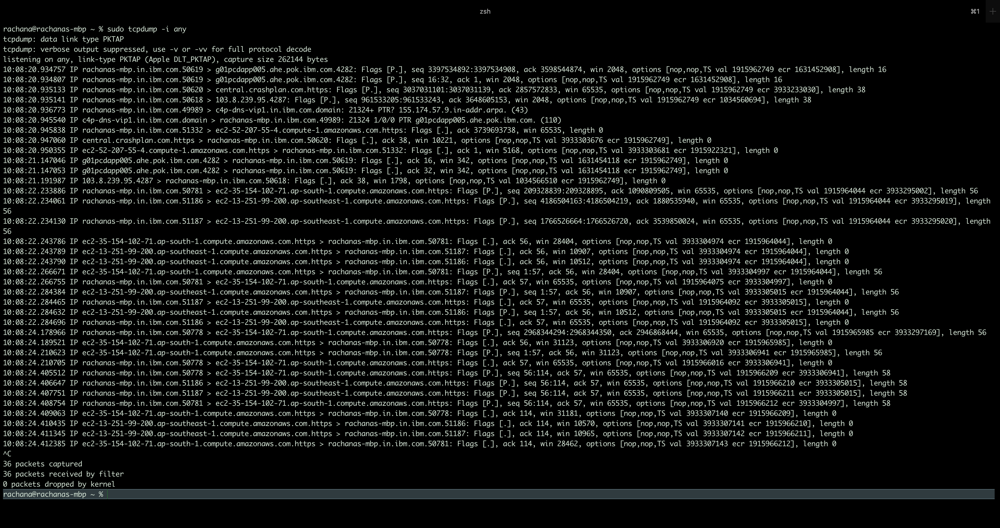

# Network Anomaly Detection
In this repo, anomalies in computer network are detected based on the patterns in the data using K-Nearest Neighbours algorithm and data are clustered into similar attack type using k-means algorithm.
## Understanding the dataset

``TCPDUMP DATA:`` tcpdump is a command line utility that allows you to capture and analyze network traffic going through your system. Since it's a command line tool, it is ideal to run in remote servers or devices for which a GUI is not available, to collect data that can be analysed later. It can also be launched in the background or as a scheduled job using tools like cron. The tcpdump command line interface provides great flexibility for capturing and analysing network traffic.



``How to save tcpdump into a file?``
```
  rachana@rachanas-mbp ~ % sudo tcpdump -i any -c10 -nn -w webserver.pcap
  Password:
  tcpdump: data link type PKTAP
  tcpdump: listening on any, link-type PKTAP (Apple DLT_PKTAP), capture size 262144 bytes
  10 packets captured
  12 packets received by filter
  0 packets dropped by kernel
```
``How to read tcpdump data file?``

```
rachana@rachanas-mbp ~ % tcpdump -nn -r webserver.pcap
reading from PCAP-NG file webserver.pcap
10:44:25.657983 IP 9.193.67.105.51392 > 13.251.99.200.443: Flags [P.], seq 99479345:99479401, ack 2339379365, win 65535, options [nop,nop,TS val 1918118693 ecr 3935458439], length 56
10:44:25.658148 IP 9.193.67.105.51393 > 13.251.99.200.443: Flags [P.], seq 1345599132:1345599188, ack 1609083055, win 65535, options [nop,nop,TS val 1918118693 ecr 3935458437], length 56
10:44:25.658276 IP 9.193.67.105.51394 > 13.251.99.200.443: Flags [P.], seq 2003315023:2003315079, ack 179835943, win 65535, options [nop,nop,TS val 1918118693 ecr 3935458438], length 56
10:44:25.668706 IP 13.251.99.200.443 > 9.193.67.105.51392: Flags [.], ack 56, win 17978, options [nop,nop,TS val 3935468403 ecr 1918118693], length 0
10:44:25.668709 IP 13.251.99.200.443 > 9.193.67.105.51393: Flags [.], ack 56, win 15114, options [nop,nop,TS val 3935468403 ecr 1918118693], length 0
10:44:25.669406 IP 13.251.99.200.443 > 9.193.67.105.51394: Flags [.], ack 56, win 15317, options [nop,nop,TS val 3935468404 ecr 1918118693], length 0
10:44:25.708463 IP 13.251.99.200.443 > 9.193.67.105.51393: Flags [P.], seq 1:57, ack 56, win 15114, options [nop,nop,TS val 3935468443 ecr 1918118693], length 56
10:44:25.708529 IP 9.193.67.105.51393 > 13.251.99.200.443: Flags [.], ack 57, win 65535, options [nop,nop,TS val 1918118741 ecr 3935468443], length 0
10:44:25.709110 IP 13.251.99.200.443 > 9.193.67.105.51394: Flags [P.], seq 1:57, ack 56, win 15317, options [nop,nop,TS val 3935468444 ecr 1918118693], length 56
10:44:25.709158 IP 9.193.67.105.51394 > 13.251.99.200.443: Flags [.], ack 57, win 65535, options [nop,nop,TS val 1918118741 ecr 3935468444], length 0

```

``So, what's next?``

If you need a graphical tool to understand more complex flows, look at Wireshark. One benefit of Wireshark is that it can read .pcap files captured by tcpdump. You can use tcpdump to capture packets in a remote machine that does not have a GUI and analyse the result file with Wireshark, but that is a topic for another day.

``ATTACKS``

A connection is a sequence of TCP packets starting and ending at some well defined times, between which data flows to and from a source IP address to a target IP address under some well defined protocol.  Each connection is labeled as either normal, or as an attack, with exactly one specific attack type.  Each connection record consists of about 100 bytes.

Attacks fall into four main categories:
1. DOS: denial-of-service, e.g. syn flood;
2. R2L: unauthorized access from a remote machine, e.g. guessing password;
3. U2R:  unauthorized access to local superuser (root) privileges, e.g., various buffer overflow attacks.
4. probing: surveillance and other probing, e.g., port scanning.

The datasets contain a total of 24 training attack types(back dos, buffer_overflow u2r, ftp_write r2l, guess_passwd r2l, imap r2l, ipsweep probe, land dos, loadmodule u2r, multihop, r2l, neptune dos, nmap probe, perl u2r, phf r2l, pod dos, portsweep probe, rootkit u2r, satan, probe, smurf dos, spy r2l, teardrop dos, warezclient r2l, warezmaster r2l), with an additional 14 types in the test data only.

### Feature Name(Type) - Description

#### Features of individual TCP connections
1. Duration(continuous) - length (number of seconds) of the connection
2. protocol_type(discrete) - type of the protocol, e.g. tcp, udp, etc.
3. service(discrete) - network service on the destination, e.g., http, telnet, etc.
4. src_bytes(continuous) - number of data bytes from source to destination
5. dst_bytes(continuous) - number of data bytes from destination to source
6. flag(discrete) - normal or error status of the connection
7. land(discrete) - 1 if connection is from/to the same host/port; 0 otherwise
8. wrong_fragment(continuous) - number of wrong fragments
9. urgent(continuous) - number of urgent packets

#### Features within a connection suggested by domain knowledge

1. hot(continuous) - number of hot indicators
2. num_failed_logins(continuous) - number of failed login attempts
3. logged_in(discrete) - 1 if successfully logged in; 0 otherwise
4. num_compromised(continuous) - number of compromised conditions
5. root_shell(discrete) - 1 if root shell is obtained; 0 otherwise
6. su_attempted(discrete) - 1 if su root command attempted; 0 otherwise
7. num_root(continuous) - number of root accesses
8. num_file_creations(continuous) - number of file creation operations
9. num_shells(continuous) - number of shell prompts
10. num_access_files(continuous) - number of operations on access control files
11. num_outbound_cmds(continuous) - number of outbound commands in an ftp session
12. is_hot_login(discrete) - 1 if the login belongs to the "hot" list; 0 otherwise
13. is_guest_login(discrete) - 1 if the login is a "guest" login; 0 otherwise

#### Traffic features computed using a two-second time window

1. count(continuous) - number of connections to the same host as the current connection in the past two seconds
2. serror_rate(continuous) - % of connections that have "SYN" errors
3. rerror_rate(continuous) - % of connections that have "REJ" errors
4. same_srv_rate(continuous) - % of connections to the same service
5. diff_srv_rate(continuous) - % of connections to different services
6. srv_count(continuous) - number of connections to the same service as the current connection in the past two seconds
7. srv_serror_rate(continuous) - % of connections that have "SYN" errors
8. srv_rerror_rate(continuous) - % of connections that have "REJ" errors
9. srv_diff_host_rate(continuous) - % of connections to different hosts
